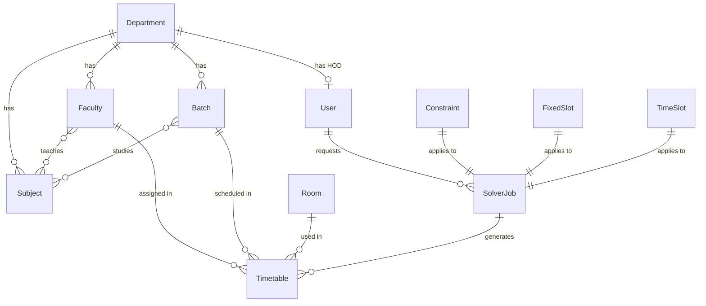

# TimeTuner Database Architecture

## Overview

MongoDB-based document storage with 12 collections designed for flexible timetable scheduling.

## Entity Relationship Diagram



## Collections

| Collection | Purpose | Key Indexes |
|------------|---------|-------------|
| **users** | Authentication & authorization | email (unique), role |
| **departments** | Academic departments | code (unique) |
| **faculties** | Teaching staff | employeeId (unique), department |
| **rooms** | Classrooms & labs | code (unique), type+capacity |
| **subjects** | Courses & labs | code (unique), department+semester |
| **batches** | Student groups | code (unique), department+semester |
| **timeslots** | Schedule structure | department+shift |
| **constraints** | Optimization rules | department, isDefault |
| **fixedslots** | Pre-assigned slots | department+semester |
| **solverjobs** | Optimization tasks | status+createdAt, requestedBy |
| **timetables** | Generated schedules | department+semester+status |
| **auditlogs** | Change tracking | entity+entityId, createdAt (TTL) |

## Schema Details

### Hard Constraints (Must Never Violate)
- No batch double-booked in same slot
- No room double-booked in same slot
- No faculty double-booked in same slot
- Faculty only assigned to qualified subjects
- Room capacity >= batch size
- Labs only in lab rooms

### Soft Constraints (Optimized)
- Faculty load balance across days
- Avoid consecutive classes for faculty
- Student daily class limit (comfort)
- Even subject distribution across week
- Minimize idle gaps for faculty
- Match faculty preferred slots

## Connection String Format

```
mongodb+srv://<username>:<password>@<cluster>.mongodb.net/<database>?retryWrites=true&w=majority
```

## Backup Strategy

- **Atlas M10+**: Automatic cloud backups
- **Free Tier**: Manual mongodump exports
- **Retention**: 90 days for audit logs (TTL index)
